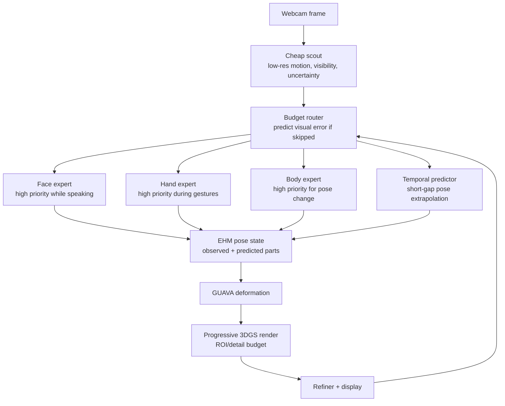
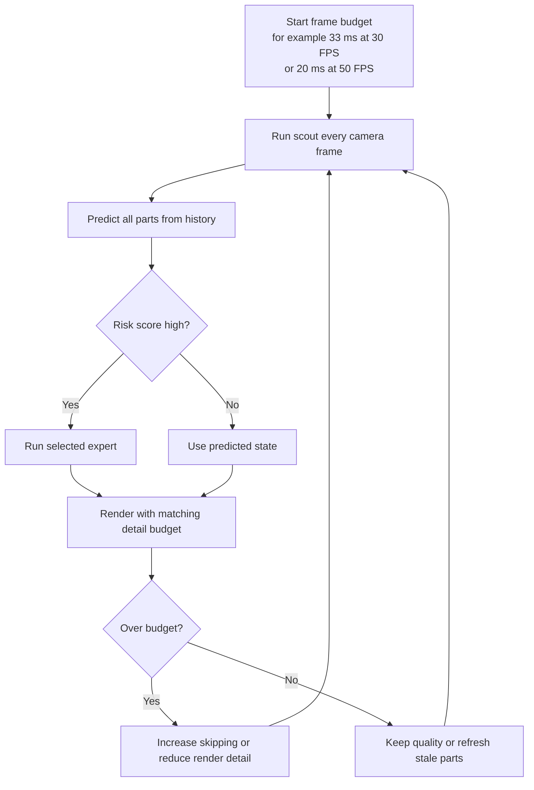

# AvatarBudget: A Real-Time Monocular Gaussian Avatar Pipeline Under a Fixed FPS Budget

**Goal.** Build a single-GPU webcam-to-avatar system that keeps real-time FPS while preserving the visual details people notice most: face, hands, silhouette, and fast motion.

**Core claim.** Prior work makes trackers fast and renderers fast separately. The missing problem is what happens when both must share one GPU inside one frame budget. Our contribution is a render-aware compute scheduler that decides which avatar parameters deserve expensive tracking now, and which can be safely predicted from recent states.

---

## 1. Story Flow

1. **Past work solved isolated parts.** PEAR accelerates expressive mesh recovery. GUAVA accelerates one-shot Gaussian avatar rendering. Distillation papers compress trackers or renderers separately.
2. **Real deployment couples the parts.** In a webcam loop, tracking, deformation, Gaussian rasterization, neural refinement, capture, crop, and synchronization compete for the same GPU budget.
3. **Naive student distillation is not enough.** A smaller tracker can be fast, but parameter loss does not know which errors are visually important after GUAVA renders the avatar.
4. **Our reframing.** The problem is not only "make PEAR smaller." The problem is "spend GPU time where the final rendered avatar would otherwise look wrong."
5. **Proposed solution.** Use a cheap always-on scout, temporal prediction, render-impact scoring, conditional part experts, and progressive Gaussian rendering under a hard FPS controller.

---

## 2. Architecture

**Noob version.** Imagine the system has a fixed amount of GPU money every frame. It first spends a very small coin to check where change might be happening. If the face is moving, it spends bigger money on the face. If the hands are still, it reuses/predicts their previous pose for one or two frames. If a hand starts moving, the cheap scout detects risk and the router sends compute back to the hand expert.

Important: this is not zero computation. There is always a small computation that watches the whole image. The novelty is that the expensive computation is conditional.

---

## 3. How Hands Are Predicted From Previous States

The system keeps a short history of hand pose parameters:

\[
q_{t-3}, q_{t-2}, q_{t-1}
\]

where \(q\) is the hand pose in EHM/SMPL-X rotation space. A simple baseline is constant velocity:

\[
\hat{q}_t = q_{t-1} + (q_{t-1} - q_{t-2})
\]

If the hand is still, \(q_{t-1} - q_{t-2}\) is almost zero, so the predicted pose is almost the same as the last pose. A stronger version uses a tiny causal GRU, temporal MLP, or Kalman filter to predict:

- next hand pose,
- uncertainty,
- whether the prediction is safe for another frame.

This prediction should only cover short gaps. A good rule is 1-3 skipped tracker updates, with forced refresh after that.

---

## 4. How the System Knows What Is Moving

It cannot know for free. It uses cheap signals:

| Signal | What it checks | Cost |
|---|---|---:|
| Low-res scout CNN | Is there motion or appearance change near face/hands/body? | Very low |
| Previous ROI projection | Where should each hand/face/body part appear now? | Very low |
| Feature difference | Did the current crop look different from the previous crop? | Low |
| Tiny optical-flow-like score | Are pixels/features moving in that region? | Low |
| Prediction uncertainty | Is the temporal predictor becoming unsure? | Very low |
| Time since refresh | Has this part been skipped too long? | Very low |
| Render-impact score | Would an error here visibly damage the avatar? | Precomputed or cheap |

The router should not ask only "is this moving?" The better question is:

> If I skip this part now, how much will the final rendered avatar look wrong?

That is the CVPR-level angle. Smooth predictable motion may be safe to extrapolate, but a subtle finger gesture near the camera may need immediate tracking because it is visually important.

---

## 5. Module Design: Cheap Scout and Budget Router

### 5.1 Cheap Scout

**Purpose.** The cheap scout is not a pose estimator. It is a tiny always-on watcher that answers:

> Which body parts might need expensive tracking in this frame?

It runs every camera frame, but at low resolution and low cost.

**Inputs**

- current webcam frame, downsampled to a small resolution such as 128x96 or 160x120,
- previous low-resolution scout features,
- previous EHM/SMPL-X part locations projected into the image,
- last known face, hand, and body states,
- time since each part was last fully updated.

**Outputs**

| Output | Meaning |
|---|---|
| `motion_score[p]` | Did part `p` appear to move? |
| `visibility[p]` | Is part `p` visible enough to trust? |
| `roi[p]` | Where should the expensive expert look? |
| `scout_confidence[p]` | Is the cheap scout confident? |
| `appearance_delta[p]` | Did the crop/features change from the previous frame? |

Here, `p` can be face, left hand, right hand, torso, or full body.

**Simple first implementation**

1. Downsample the frame.
2. Project the previous EHM hand/face/body positions into the current image.
3. Expand each ROI a little so sudden motion is not missed.
4. Extract tiny CNN features for each ROI.
5. Compare current ROI features with previous ROI features.
6. Return a motion/risk signal per part.

**Noob version.** The cheap scout is like checking the whole screen with blurry eyes. It cannot recover exact finger pose, but it can say "something changed near the right hand, wake up the hand tracker."

### 5.2 Budget Router

**Purpose.** The budget router is the decision module. It chooses which expensive modules are allowed to run while FPS stays fixed.

It answers:

> If I skip this part now, how much will the final GUAVA render look wrong?

**Inputs**

- cheap scout outputs,
- temporal predictor uncertainty,
- render-impact weight for each part,
- current GPU timing budget,
- time since each part was last refreshed,
- minimum refresh rule, for example refresh every part at least once every `N` frames.

**Risk score**

For each part `p`, compute a simple risk score:

\[
R_p =
\alpha M_p +
\beta U_p +
\gamma S_p +
\delta I_p +
\lambda V_p
\]

where:

- \(M_p\) = motion/appearance change from cheap scout,
- \(U_p\) = prediction uncertainty,
- \(S_p\) = staleness, meaning how long since this part was fully tracked,
- \(I_p\) = render-impact weight, meaning how visible/damaging this part is in the avatar render,
- \(V_p\) = visibility or crop confidence.

Then the router runs expensive experts only for parts with high risk, while respecting the frame budget.

**Output decisions**

| Decision | Example |
|---|---|
| `run_face_expert = true/false` | Run when mouth or expression risk is high. |
| `run_left_hand_expert = true/false` | Run when left hand changes or uncertainty grows. |
| `run_right_hand_expert = true/false` | Run when right hand changes or uncertainty grows. |
| `run_body_expert = true/false` | Run when torso/arm pose changes. |
| `render_detail[p]` | Increase Gaussian/render detail for risky visible regions. |
| `force_refresh[p]` | Refresh a stale part even if motion looks low. |

**Noob version.** The router is the manager. The scout says, "maybe the hand moved." The predictor says, "I am no longer confident." The renderer says, "hand errors are very visible right now." The router combines those signals and decides to spend compute on the hand this frame.

### 5.3 Training the Router

The strongest training label is counterfactual render damage.

For a training video frame:

1. Run the full PEAR teacher and render with GUAVA. This is the best available target.
2. Simulate skipping one part, for example reuse/predict the hand instead of tracking it.
3. Render again.
4. Measure visual damage with LPIPS, L1, SSIM, silhouette IoU, and face/hand crop error.
5. Train the router to predict this damage from cheap scout features.

This is why the router is a research contribution, not just an engineering trick. It learns what skipping means in the final avatar image.

---

## 6. Is It Okay to Use PEAR Instead of EHM-Tracker?

Yes, but only for the correct part of the pipeline.

| Pipeline stage | Use PEAR? | Use EHM-Tracker? | Recommendation |
|---|---:|---:|---|
| Live per-frame pose tracking | Yes | No | Use PEAR or your PEAR student. This is the real-time stage. |
| Driving GUAVA animation | Yes | No | PEAR outputs EHM-compatible pose parameters, so it can drive the avatar. |
| One-time source identity fitting | Maybe | Yes | Keep EHM-Tracker for now, or use PEAR only as initialization. |
| Reducing avatar creation time | Maybe | Yes | PEAR can warm-start EHM-Tracker, but should not be assumed to replace it without testing. |

**Plain explanation.** EHM-Tracker and PEAR do different jobs. EHM-Tracker is mainly for fitting the source person's identity/shape from the source image, which happens once during avatar creation. PEAR is for fast per-frame pose/expression prediction from webcam frames, which happens during live animation.

So the safe architecture is:

- **offline/enrollment:** source image or few images -> EHM-Tracker or PEAR-initialized EHM fitting -> GUAVA avatar identity,
- **online/live:** webcam frame -> PEAR/student PEAR -> EHM pose -> GUAVA render.

If your question is "Can I use PEAR for the online tracker instead of optimization-based EHM tracking?" then yes, absolutely. If your question is "Can I remove EHM-Tracker completely from avatar creation?" then only after an experiment proves PEAR gives GUAVA the same quality source identity.

---

## 7. Architecture Blocks Connected to Contributions

| Architecture block | Related contribution | Purpose in the paper | Noob explanation |
|---|---|---|---|
| Webcam + timing instrumentation | C1 | Measures the real cost of the complete system. | Shows why PEAR FPS + GUAVA FPS does not equal pipeline FPS. |
| Cheap scout | C3, C4 | Provides low-cost evidence for compute routing. | A small watcher checks which part might need attention. |
| Budget router | C3 | Predicts the visual cost of skipping each part. | The decision maker chooses where GPU time goes. |
| Temporal predictor | C3, C5 | Fills short gaps when full tracking is skipped. | If the hand was still, keep it still for a frame or two. |
| Conditional face/hand/body experts | C4 | Avoids running the full tracker for every part every frame. | Call the specialist only when that body part matters. |
| PEAR/student tracker | C2, C4 | Produces EHM pose parameters for live animation. | Your current student can become this fast tracker. |
| EHM pose state | C2, C3 | Stores observed and predicted pose in one consistent state. | Combines real updates and predicted updates before rendering. |
| GUAVA deformation + render | C2, C5 | Converts tracking error into visible avatar error. | The renderer tells us which pose errors actually look bad. |
| Progressive render/detail budget | C5 | Adapts render quality under the same FPS budget. | Render important moving regions carefully and stable regions cheaper. |
| Collapse diagnostics | C6 | Detects student failure before final rendering. | Catches when the student outputs average pose for every image. |

---

## 8. Proposed Contributions

### C1. Single-GPU Coupling Benchmark

**Research contribution.** First benchmark showing that tracker FPS and renderer FPS do not compose when both stages share one GPU.

**Noob version.** PEAR may be fast alone and GUAVA may be fast alone, but when both run together they fight for the same GPU. We measure that fight directly.

**Architecture connection.** This contribution measures every block in the architecture, then compares isolated modules against the full shared-GPU pipeline.

### C2. Render-Impact Distillation

**Research contribution.** Train the student tracker using weights derived from GUAVA's rendered output, not only parameter-space error.

**Noob version.** Some pose numbers matter more than others. If a small finger error visibly breaks the render, punish it more. If a hidden parameter barely changes the image, punish it less.

**Architecture connection.** This links the PEAR/student tracker to GUAVA. The renderer teaches the tracker which mistakes matter visually.

### C3. Counterfactual Budget Router

**Research contribution.** A runtime scheduler predicts the visual damage of skipping each body part and spends expensive inference only where skipping would hurt.

**Noob version.** The system asks: "What would happen to the final avatar if I do not update the hands this frame?" If the answer is "almost nothing," it saves compute.

**Architecture connection.** This is the cheap scout + temporal predictor + budget router. It is the central new module.

### C4. Part-Conditional Tracking Experts

**Research contribution.** Replace one always-on monolithic tracker with lightweight shared features plus conditional face, hand, and body experts.

**Noob version.** Do not run the full brain for every part every frame. Run a small brain always, then call the face/hand/body specialist only when needed.

**Architecture connection.** This is where your current CNN-transformer student can evolve: shared backbone first, then separate heads/experts for face, hands, and body.

### C5. Progressive Gaussian Rendering Under a Frame Budget

**Research contribution.** Couple tracking decisions with GUAVA rendering quality so the renderer can spend more samples/detail on visually risky regions.

**Noob version.** If the hands are moving near the camera, render that region carefully. If the torso is stable, render it cheaper.

**Architecture connection.** This is the GUAVA-side partner of the router. The same risk score affects both tracking and rendering.

### C6. Collapse Diagnostics for Regression Distillation

**Research contribution.** Provide diagnostics that detect when a student predicts the average pose instead of reading the image.

**Noob version.** A student can look like it is training but secretly output the same pose every time. We add tests that catch that early.

---

## 9. Where Your Current Student Architecture Fits

Your CNN backbone + transformer head student is useful, but it should become one part of the system, not the whole paper.

| Current student component | Useful in proposed pipeline? | What to do next |
|---|---|---|
| CNN backbone | Yes | Reuse as the cheap shared feature extractor or fast full-body fallback. |
| Transformer head | Yes | Keep for global pose reasoning, but make face/hand/body outputs separable. |
| Training on two datasets | Yes | Good start for generalization, but add render-aware supervision. |
| Parameter KD | Partly | Keep as baseline, but not as the main novelty. |
| Feature KD | Partly | Useful, especially for stabilizing the student. |

**Key advice.** Do not sell the paper as "we made a smaller PEAR student." That is likely too close to standard distillation. Sell it as "we learned how to allocate compute in an end-to-end avatar pipeline using render-visible error."

---

## 10. FPS-Locked Runtime Loop

This loop makes FPS a hard constraint. Quality adapts, not FPS.

---

## 11. Immediate Next Plan

### Step 1. Lock the FPS target

Choose the non-negotiable target:

- 30 FPS means 33.3 ms per displayed frame.
- 50 FPS means 20.0 ms per displayed frame.
- 60 FPS means 16.7 ms per displayed frame.

If you cannot compromise FPS, the system must degrade quality, refresh rate per part, or render detail before it allows FPS to drop.

### Step 2. Build a timing table for every stage

Measure on the same GPU:

- camera capture,
- crop/detection/matting,
- student inference,
- PEAR teacher inference,
- EHM conversion,
- GUAVA deformation,
- Gaussian rasterization,
- StyleUNet refinement,
- display/readback.

Without this table, you cannot design a valid budget router.

### Step 3. Run the critical A/B experiment

Train two students with the same architecture and same FPS:

| Model | Training objective | Purpose |
|---|---|---|
| Student A | Current parameter + feature KD | Baseline |
| Student B | Render-impact-weighted KD | Proposed method |

If Student B gives better rendered avatar quality at the same FPS, this becomes a strong method paper.

### Step 4. Add student health checks before long training

Track:

- `pose_vs_constant`,
- `blindness_norm`,
- `deviation_cosine`,
- per-part geodesic error,
- hand/face crop render LPIPS,
- temporal jitter.

Stop bad runs early. Do not spend weeks training a collapsed student.

### Step 5. Implement the cheap scout

Start simple:

- use previous projected face/hand/body boxes,
- crop small low-res ROIs,
- compute feature difference and motion score,
- output risk per part.

Then train a tiny CNN router using labels from counterfactual render damage.

### Step 6. Add conditional execution

Run:

- face expert when mouth/expression risk is high,
- hand expert when gesture risk is high,
- body expert when torso/arm motion risk is high,
- prediction otherwise.

Always force refresh stale parts after a small number of frames.

### Step 7. Couple tracking and rendering

When a part is risky, give it both:

- tracker compute,
- render detail.

When a part is stable, reduce both:

- use predicted pose,
- render with cheaper Gaussian/detail settings.

---

## 12. Minimum Paper Figure Set

1. **Pipeline figure.** Cheap scout + router + conditional experts + GUAVA progressive renderer.
2. **Coupling benchmark.** PEAR alone, GUAVA alone, serial pipeline, async pipeline, split-GPU upper bound, shared-GPU deployment.
3. **Render-impact heatmap.** Which EHM parameters affect visible avatar error.
4. **Student A vs. Student B.** Same FPS, render-aware student has better face/hand visual quality.
5. **Quality/FPS Pareto curve.** Accuracy and render quality under 20 ms / 33 ms frame budgets.
6. **Failure case figure.** Parameter KD collapses or loses subtle hands/expressions; render-aware routing recovers them.

---

## 13. Final Positioning Statement

**AvatarBudget studies real-time avatar generation as a coupled compute allocation problem, not an isolated tracker-compression problem.** Given a single webcam frame and a fixed GPU frame budget, the system predicts which pose updates and render details would most affect the final Gaussian avatar, then conditionally spends compute on those parts. This gives a stronger research story than a plain CNN-transformer student because the novelty is end-to-end, render-aware, latency-aware, and directly tied to what the user sees.
