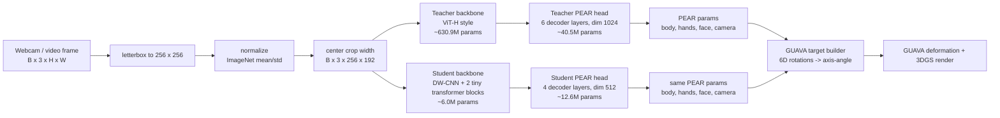
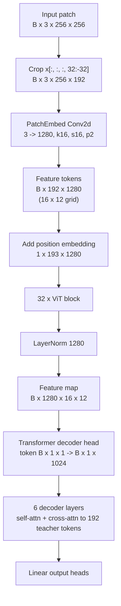
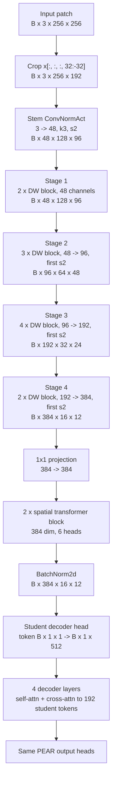

# PEAR Teacher vs Student Architecture

This compares the frozen PEAR teacher used by `Ehm_Pipeline` with the compact
PEAR-compatible student added in `models/pipeline/student_pipeline.py`.

## High-Level Flow

## Teacher: PEAR ViT-H Pipeline

Teacher ViT block, repeated 32 times:

| Layer | Shape / Dim |
|---|---:|
| LayerNorm | 1280 |
| MHA qkv | 1280 -> 3840 |
| Heads | 16 heads, 80 dim/head |
| Attention out | 1280 -> 1280 |
| LayerNorm | 1280 |
| MLP | 1280 -> 5120 -> 1280 |

Teacher decoder head:

| Layer | Shape / Dim |
|---|---:|
| Input token projection | 1 -> 1024 |
| Decoder depth | 6 |
| Self-attn | dim 1024, 8 heads, 64 dim/head |
| Cross-attn context | 192 tokens x 1280 |
| FFN | 1024 -> 1024 -> 1024 |

## Student: Compact PEAR-Compatible Pipeline

Depthwise block:

| Layer | Shape / Dim |
|---|---:|
| Pointwise conv | C -> 4C |
| Depthwise conv | 4C -> 4C, k3 |
| Pointwise projection | 4C -> C_out |
| Residual | only when stride=1 and C=C_out |

Student spatial transformer block, repeated 2 times:

| Layer | Shape / Dim |
|---|---:|
| LayerNorm | 384 |
| MHA | 384 dim, 6 heads, 64 dim/head |
| LayerNorm | 384 |
| MLP | 384 -> 1152 -> 384 |

Student decoder head:

| Layer | Shape / Dim |
|---|---:|
| Input token projection | 1 -> 512 |
| Decoder depth | 4 |
| Self-attn | dim 512, 8 heads, 64 dim/head |
| Cross-attn context | 192 tokens x 384 |
| FFN | 512 -> 1024 -> 512 |

## Output Heads

Both teacher and student produce the same output dictionary.  The only
difference is the decoder token dimension: teacher uses 1024, student uses 512.

| Output | Dim |
|---|---:|
| `body_param.global_pose` | 1 rotation, from 6D -> 3 x 3 |
| `body_param.body_pose` | 21 rotations, from 21 x 6D -> 21 x 3 x 3 |
| `body_param.left_hand_pose` | 15 rotations, from 15 x 6D -> 15 x 3 x 3 |
| `body_param.right_hand_pose` | 15 rotations, from 15 x 6D -> 15 x 3 x 3 |
| `body_param.exp` | 50 |
| `body_param.shape` | 200 |
| `body_param.hand_scale` | 3 |
| `body_param.head_scale` | 3 |
| `flame_param.eye_pose_params` | 6 |
| `flame_param.pose_params` | 3 |
| `flame_param.jaw_params` | 3 |
| `flame_param.eyelid_params` | 2 |
| `flame_param.expression_params` | 50 |
| `flame_param.shape_params` | 300 |
| `pd_cam` | B x 4 x 4 camera RT |

## Approximate Parameter Counts

| Model part | Teacher | Student |
|---|---:|---:|
| Backbone | 630.9M | 6.0M |
| Decoder + output heads | 40.5M | 12.6M |
| Total | 671.4M | 18.7M |

These counts exclude non-trainable buffers and are meant as architecture-scale
numbers, not checkpoint byte counts.

## Large Student Candidate

For the higher-quality student, use `third_party/PEAR/configs/student_l70.yaml`.
It keeps the same PEAR output contract but increases the capacity enough to be
a realistic final-model candidate instead of only a speed prototype.

| Model part | Student-S | Student-L70 |
|---|---:|---:|
| Backbone | 6.0M | 32.4M |
| Decoder + output heads | 12.6M | 39.2M |
| Total | 18.7M | 71.6M |

Student-L70 architecture:

| Block | Shape / Dim |
|---|---:|
| Input crop | B x 3 x 256 x 192 |
| Stem | 3 -> 96, stride 2 |
| Stage 1 | 2 depthwise blocks, 96 channels |
| Stage 2 | 3 depthwise blocks, 96 -> 192 |
| Stage 3 | 6 depthwise blocks, 192 -> 384 |
| Stage 4 | 3 depthwise blocks, 384 -> 640 |
| Feature map | B x 640 x 16 x 12 |
| Spatial transformer | 4 blocks, 640 dim, 10 heads |
| Decoder | 5 layers, 768 dim, 12 heads |
| Cross-attn context | 192 tokens x 640 |
